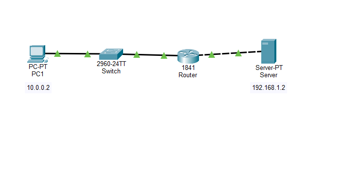
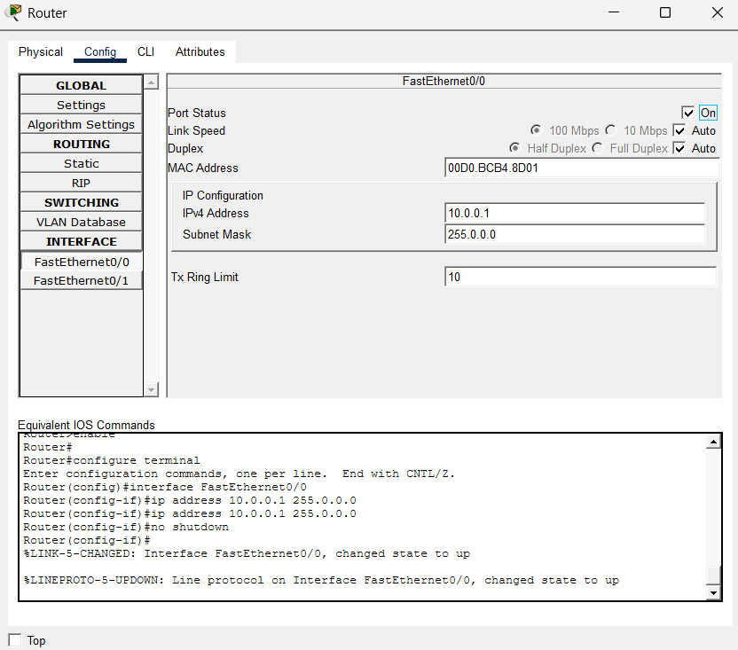
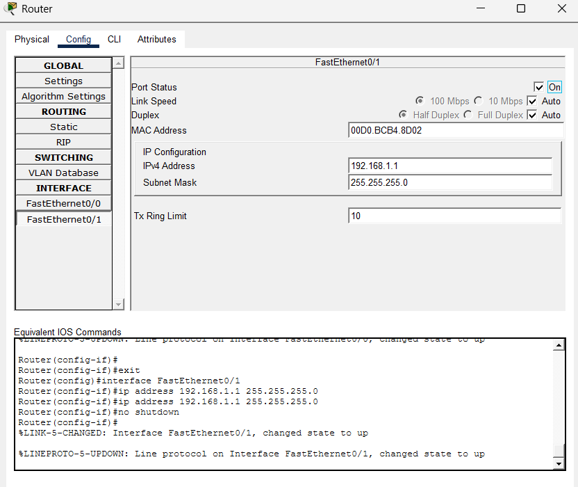
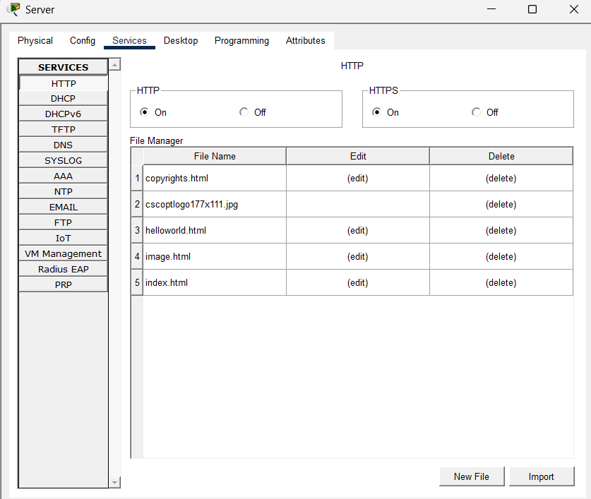
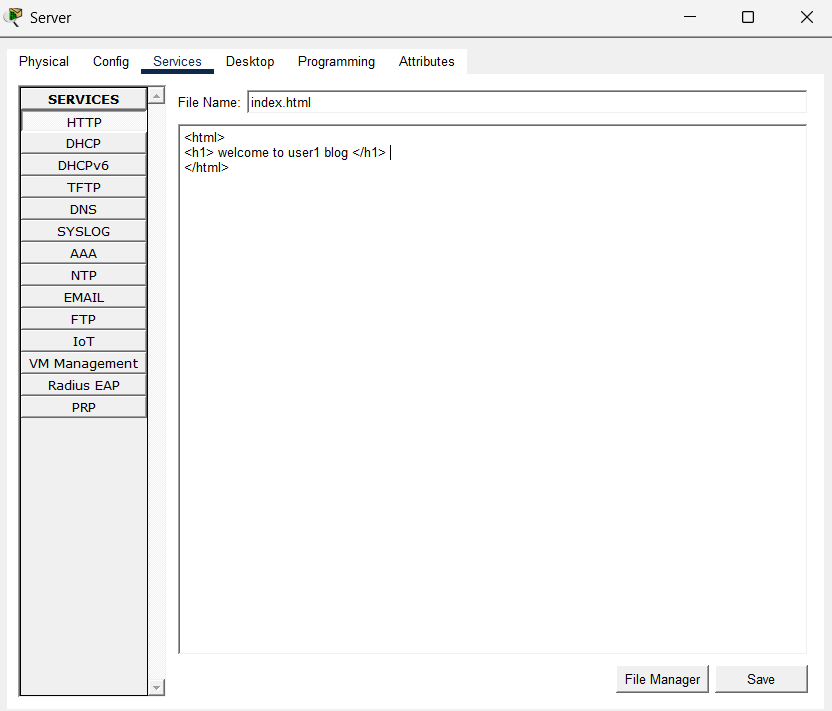
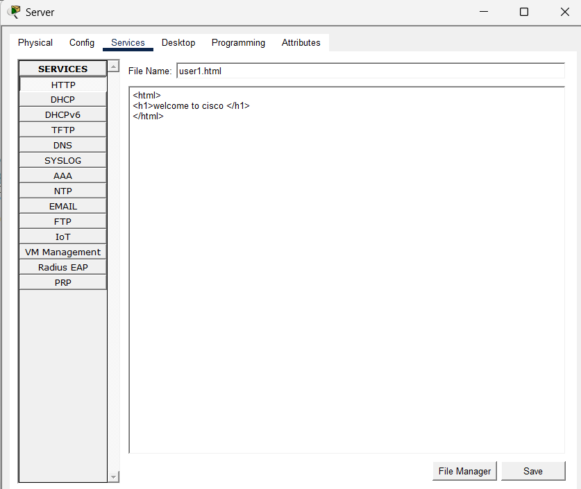
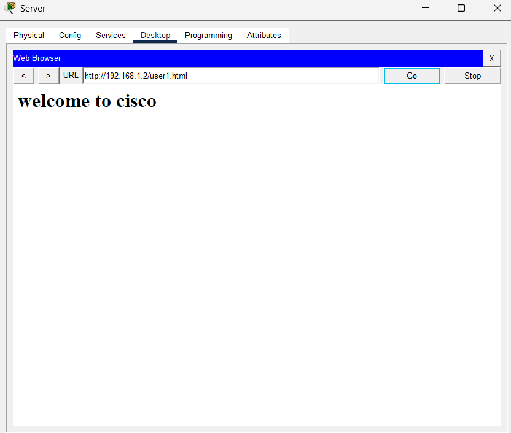
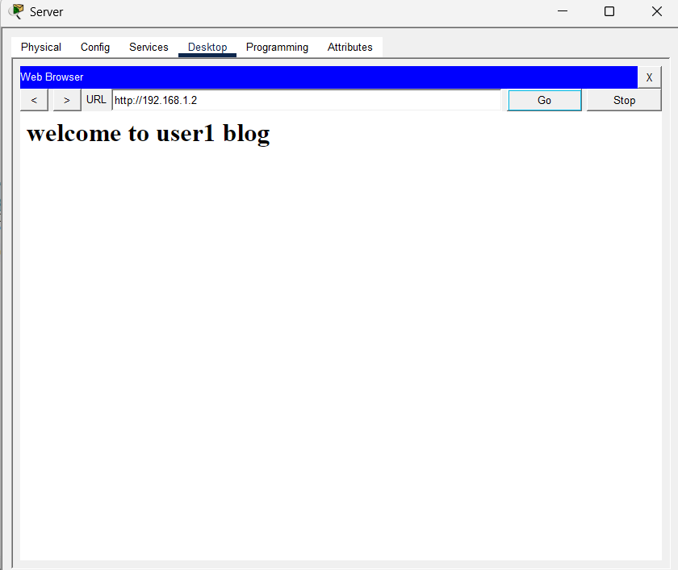

#  Project 10 - HTTP Web Server Configuration

##  Genel Bakış

Bu projede Cisco Packet Tracer üzerinde bir HTTP Web Server yapılandırılmıştır.

Sunucu üzerinde basit HTML sayfaları oluşturulmuş ve istemci cihaz üzerinden web tarayıcısı ile bu sayfalara erişim test edilmiştir.

---

##  Amaçlar

- HTTP servisini yapılandırmak
- Web Server mantığını öğrenmek
- HTML sayfası oluşturmak
- Router üzerinden farklı ağlar arası erişim sağlamak
- Web Browser ile bağlantı testi yapmak

---

##  Ağ Topolojisi

Bu proje aşağıdaki bileşenleri içermektedir:

- 1 Router
- 1 Switch
- 1 Server
- 1 PC

 Topoloji:



---

##  IP Adresleme

### Router

| Interface | IP Address | Subnet Mask |
|----------|------------|-------------|
| FastEthernet0/0 | 10.0.0.1 | 255.0.0.0 |
| FastEthernet0/1 | 192.168.1.1 | 255.255.255.0 |

### PC

| Device | IP Address | Gateway |
|--------|-----------|---------|
| PC1 | 10.0.0.2 | 10.0.0.1 |

### Server

| Device | IP Address | Gateway |
|--------|-----------|---------|
| Server | 192.168.1.2 | 192.168.1.1 |

---

##  Router Yapılandırması

```bash
enable
configure terminal

interface fastEthernet0/0
ip address 10.0.0.1 255.0.0.0
no shutdown

interface fastEthernet0/1
ip address 192.168.1.1 255.255.255.0
no shutdown
```

---

##  HTTP Server Yapılandırması

Server üzerinde HTTP servisi aktif edilmiştir.

Oluşturulan HTML dosyaları:

```text
index.html
user1.html
```

### index.html

```html
<html>
<h1> welcome to user1 blog </h1>
</html>
```

### user1.html

```html
<html>
<h1>welcome to cisco </h1>
</html>
```

---

##  Test ve Doğrulama

PC üzerinden web tarayıcısı açılarak sunucuya erişim sağlanmıştır.

Test edilen adresler:

```text
http://192.168.1.2
http://192.168.1.2/user1.html
```

Sonuç:

- Ana sayfa başarılı görüntülendi 
- user1.html sayfası başarılı görüntülendi 
- HTTP servisi çalışıyor 

---

##  Görseller

### Router Fa0/0 Configuration


### Router Fa0/1 Configuration


### Server HTTP Service


### index.html


### user1.html


### Web Test - index.html


### Web Test - user1.html


---

##  Dosyalar

- `project_10.pkt`
- `topology/`
- `router/`
- `server/`
- `clients/`
- `tests/`

---

##  Öğrenilen Kavramlar

- HTTP
- Web Server
- HTML dosyası oluşturma
- Client-Server iletişimi
- Router interface configuration
- Web Browser testi

---

##  Sonuç

Bu proje ile Cisco Packet Tracer üzerinde HTTP Web Server yapılandırılmış ve istemci cihaz üzerinden web sayfalarına başarılı şekilde erişim sağlanmıştır.

Bu çalışma, temel web servislerinin ağ üzerinde nasıl çalıştığını göstermektedir.
