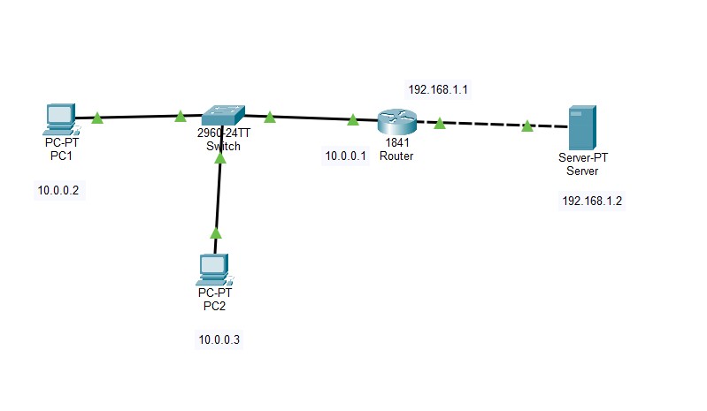
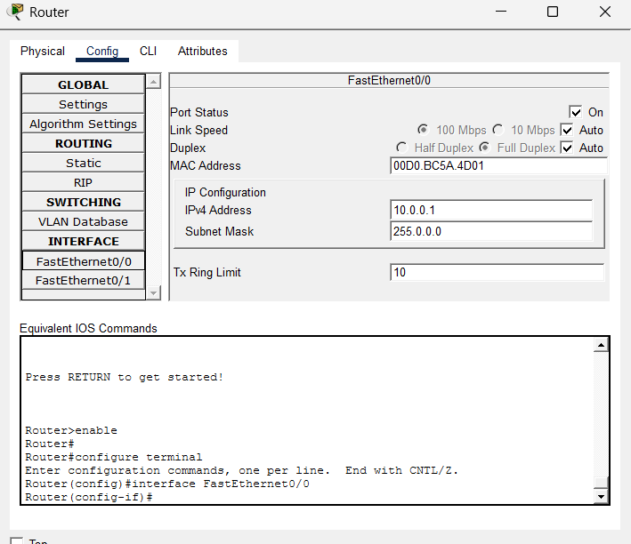
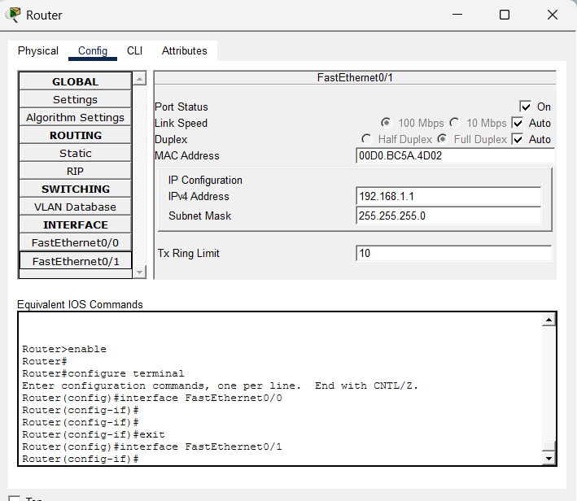
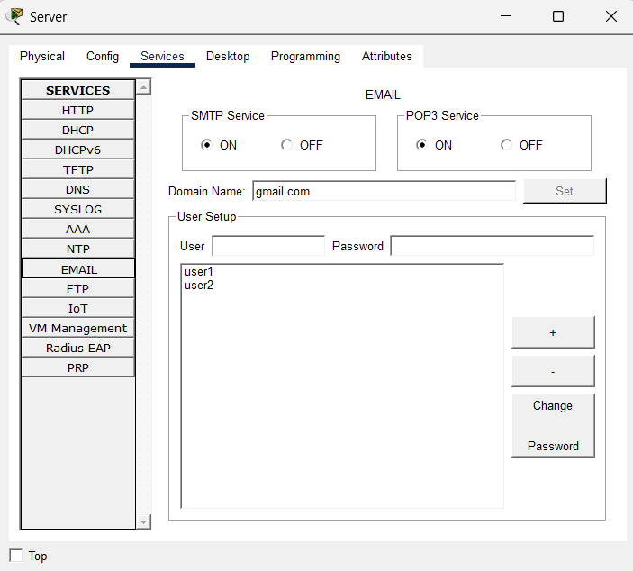
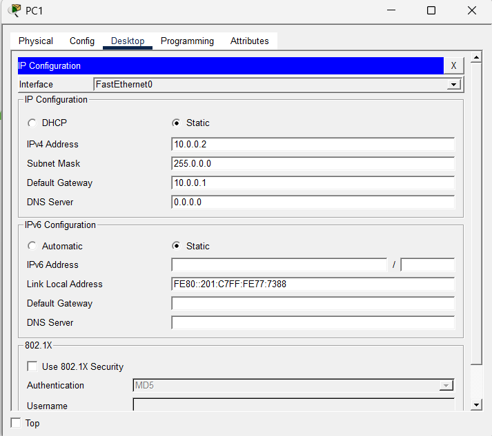
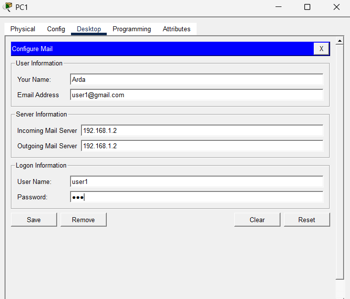
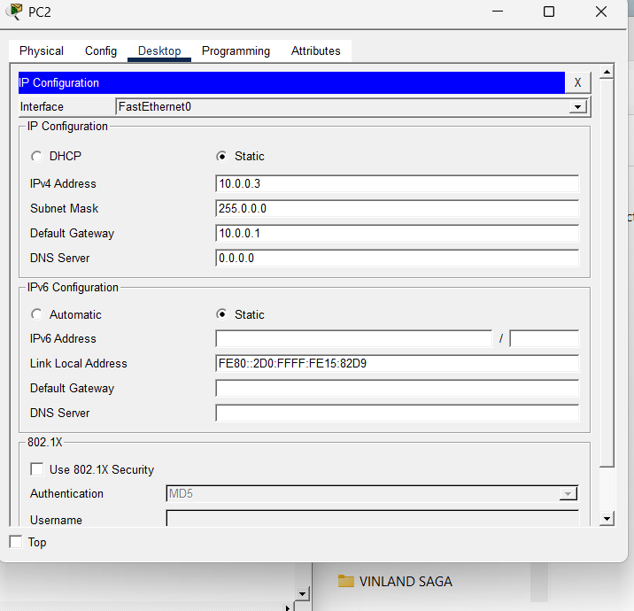
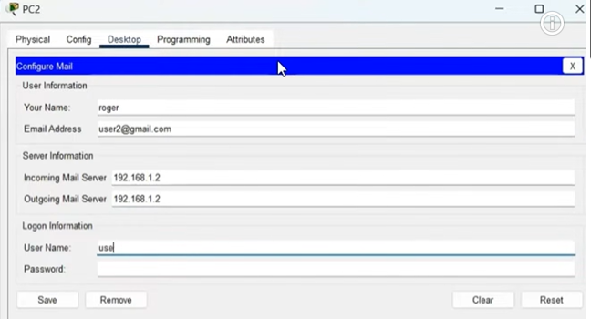

#  Project 9 - Mail Server Configuration (SMTP & POP3)

##  Genel Bakış

Bu projede bir e-posta sunucusu (Mail Server) yapılandırılmıştır.

SMTP ve POP3 servisleri kullanılarak kullanıcı hesapları oluşturulmuş, istemciler mail sunucusuna bağlanmış ve başarılı şekilde e-posta gönderip almıştır.

Bu çalışma temel ağ servisleri ve istemci-sunucu haberleşmesini göstermektedir.

---

##  Amaçlar

- Mail Server yapılandırmak
- SMTP servisini kullanmak
- POP3 servisini kullanmak
- Mail kullanıcıları oluşturmak
- İstemci mail ayarlarını yapmak
- E-posta gönderip almak
- Ağ servislerini test etmek

---

##  Ağ Topolojisi

Bu proje aşağıdaki bileşenleri içermektedir:

- 1 Router
- 1 Switch
- 1 Mail Server
- 2 PC

 Topoloji



---

##  IP Adresleme

### Router

| Interface | IP Address |
|------------|------------|
| FastEthernet0/0 | 10.0.0.1 |
| FastEthernet0/1 | 192.168.1.1 |

### Mail Server

| Device | IP Address |
|----------|------------|
| Server | 192.168.1.2 |

### Clients

| Device | IP Address |
|----------|------------|
| PC1 | 10.0.0.2 |
| PC2 | 10.0.0.3 |

---

##  Mail Server Yapılandırması

### Domain

```text
gmail.com
```

### Kullanıcılar

```text
user1
user2
```

### Aktif Servisler

- SMTP Service ✅
- POP3 Service ✅

---

##  İstemci Yapılandırmaları

### PC1

Email Address:

```text
user1@gmail.com
```

Incoming Mail Server:

```text
192.168.1.2
```

Outgoing Mail Server:

```text
192.168.1.2
```

---

### PC2

Email Address:

```text
user2@gmail.com
```

Incoming Mail Server:

```text
192.168.1.2
```

Outgoing Mail Server:

```text
192.168.1.2
```

---

##  Test ve Doğrulama

### Mail Gönderme

PC1 üzerinden:

```text
From: user1@gmail.com
To: user2@gmail.com
Subject: test mail
```

başlıklı e-posta gönderilmiştir.

 Gönderim:


---

### Mail Alma

PC2 üzerinde gelen e-posta başarılı şekilde görüntülenmiştir.

📷 Alınan Mail:


---

##  Yapılandırma Görselleri

### Router Yapılandırması





---

### Mail Server



---

### Client Yapılandırmaları

#### PC1





#### PC2





---

##  Öğrenilen Kavramlar

- SMTP
- POP3
- Mail Server
- Client Configuration
- Router Configuration
- Server Services
- Network Applications

---

##  Dosyalar

- project_9.pkt
- topology/
- router/
- server/
- clients/
- tests/

---

##  Sonuç
Bu proje ile SMTP ve POP3 servisleri kullanılarak bir mail sunucusu kurulmuş ve istemciler arasında başarılı şekilde e-posta iletişimi sağlanmıştır.

Bu çalışma istemci-sunucu mimarisinin ve ağ servislerinin temel çalışma mantığını göstermektedir.
